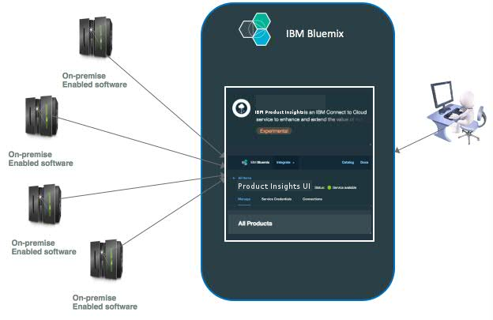
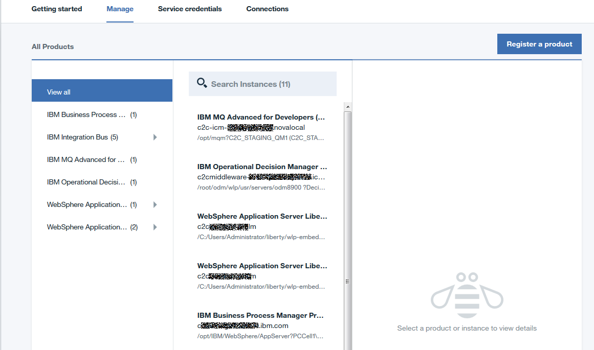

---

copyright:
  years: 2016, 2017
lastupdated: "2017-3-3"

---

<!-- Common attributes used in the template are defined as follows: -->
{:new_window: target="_blank"}
{:shortdesc: .shortdesc}

# Informazioni su IBM {{site.data.keyword.product-insights_short}}
{: #about_product-insights}

{{site.data.keyword.product-insights_full}} è un servizio IBM Bluemix, parte di IBM Connect to Cloud. Collega i tuoi prodotti software IBM in loco al tuo servizio {{site.data.keyword.product-insights_short}} e fornisce informazioni approfondite sull'esecuzione dell'inventario e sulle metriche di utilizzo del runtime.

{:shortdesc}

Il servizio {{site.data.keyword.product-insights_short}} è un punto di partenza e potrebbero venire aggiunte ulteriori funzioni in futuro.

{{site.data.keyword.product-insights_short}} fornisce le seguenti funzionalità:

* Registrazione di tuoi prodotti software IBM in loco con IBM, nello specifico con un servizio Bluemix.
* Raccolta dei dati per i prodotti in loco collegati e dei dati di utilizzo associati.
* Dashboard per i dati di utilizzo del runtime per fornire informazioni approfondite reali sul carico di lavoro e l'utilizzo del tuo prodotto.

Per utilizzare le funzionalità {{site.data.keyword.product-insights_full}}, completa le seguenti istruzioni:

1. Crea almeno un servizio in Bluemix per {{site.data.keyword.product-insights_short}}.
1. Aggiorna i tuoi prodotti software IBM in loco ai livelli di release richiesti e aggiungi l'abilitazione del codice ad ogni installazione del prodotto. 
1. Configura l'installazione software con le credenziali {{site.data.keyword.bluemix_short}} della tua istanza del servizio {{site.data.keyword.product-insights_short}}. Tutti i tuoi dati saranno archiviati in modo sicuro con tali credenziali. I dati sono disponibili solo agli utenti con le autorizzazioni corrette per il servizio.

## Come funziona
{: #product-insights_howitworks}
Il servizio {{site.data.keyword.product-insights_full}} si integra con i tuoi prodotti software IBM in loco per raccogliere e visualizzare le informazioni sul prodotto di runtime e le metriche di utilizzo. Inizialmente, una sottoserie di prodotti software IBM è stata abilitata all'integrazione con questo servizio. Quando registrati e collegati, i prodotti software in loco inviano periodicamente informazioni sull'utilizzo e sull'avvio. Le informazioni vengono archiviate in relazione a questa istanza del sevizio tramite le credenziali configurate. Puoi utilizzare il dashboard dell'istanza del servizio per visualizzare le informazioni in Bluemix.

La soluzione {{site.data.keyword.product-insights_short}} include più componenti, come illustrato nel seguente grafico:

.  

## Organizzazioni e spazi
{: #product-insights_orgs}
Il tuo servizio {{site.data.keyword.product-insights_full}} viene associato con un solo spazio o una sola organizzazione Bluemix e ha credenziali univoche. Devi configurare almeno uno spazio o un'organizzazione Bluemix. Se desideri dividere i dati, ad esempio, per limitare l'accesso a utenti specifici, puoi creare più spazi in un'organizzazione con l'istanza del servizio in ogni spazio. Ogni istanza del servizio ha credenziali univoche di cui hai bisogno da fornire ai tuoi prodotti software IBM.

Le informazioni sui prodotti configurati con una serie di credenziali sono visibili solo nel servizio con tali credenziali. Possono essere creati più servizi per dividere i dati se necessario, ognuno con credenziali univoche.

## Dashboard del servizio
{: #service_dashboard}
Dopo aver creato la tua istanza del servizio, vieni indirizzato al dashboard del servizio. Puoi sempre ritornare al dashboard del servizio facendo clic sull'icona del servizio nel tuo dashboard dell'organizzazione. Dal dashboard del servizio, puoi accedere ai seguenti elementi:

* La documentazione introduttiva
* Le credenziali del servizio di cui hai bisogno per collegare i tuoi prodotti in loco
* Un inventario di prodotti supportati e di istanze di runtime registrato nell'istanza del servizio {{site.data.keyword.product-insights_short}}
* Le informazioni di utilizzo per le istanze di runtime collegate.
* Le informazioni sull'ambiente e sul prodotto per le istanze di runtime collegate. 

Se nessun prodotto è elencato nella scheda Gestione, fai clic su **Registra un prodotto** per visualizzare un elenco di prodotti supportati e i dettagli specifici di accesso per la connessione delle istanze del prodotto.

## Registra un prodotto
{: #product-insights_register}
Nella scheda **Gestione**, fai clic su **Registra un prodotto** per visualizzare un elenco di prodotti supportati. Scorri fono al tuo prodotto o utilizza il campo di ricerca per filtrare l'elenco dei prodotti.

Per visualizzare le informazioni sulla registrazione di un'istanza di un prodotto, selezionalo dall'elenco.

Quando colleghi un'istanza del prodotto al servizio {{site.data.keyword.product-insights_short}}, viene visualizzata nella scheda **Gestione** del dashboard. Un dashboard può elencare più istanze del prodotto collegate in più prodotti differenti.

## Inventario prodotto
{: #product-insights_products}
Dopo aver abilitato le istanze del prodotto per inviare i dati a {{site.data.keyword.product-insights_short}}, puoi visualizzare il tuo inventario selezionando **Gestione** nel dashboard del servizio.

 

Per {{site.data.keyword.product-insights_short}}, un prodotto è diverso da un'istanza del prodotto. Un prodotto ha un nome prodotto, come IBM MQ o IBM WebSphere Application Server Liberty Network Deployment. Un'istanza del prodotto viene utilizzata per rappresentare un prodotto dopo che è stato installato ed è in esecuzione. Alcuni prodotti hanno più istanze eseguite nella stessa installazione del prodotto. Ad esempio, WebSphere Application Server Liberty Network Deployment può eseguire più server delle applicazioni creati da una sola installazione del prodotto.

Nel dashboard del servizio, i nomi dei prodotti registrati sono visualizzati nella scelta *Visualizza tutto* nel pannello **Prodotti**. Le istanze collegate sono elencate nel pannello **Istanze**. Questo pannello contiene le istanze dei prodotti selezionate nel pannello **Prodotti**. Nel seguente esempio, sono visualizzate tutte le istanze del prodotto perché è selezionata la scelta *Visualizza tutto* nel pannello Prodotti. Questo esempio mostra sei prodotti, alcuni con più istanze collegate. Puoi filtrare l'elenco delle istanze utilizzando il campo **Cerca istanze** o selezionando un prodotto vuoto. Per visualizzare i dettagli di un'istanza del prodotto, selezionane la voce nel pannello **Istanze**.

L'elenco delle istanze del prodotto visualizzate viene filtrato per la tua esplorazione. Per agevolare la navigazione, viene visualizzato il percorso di esplorazione a un'istanza selezionata.

 

## Informazioni sull'istanza del prodotto
{: #product-insights_productinstances}
Quando viene selezionata un'istanza del prodotto, viene popolato il pannello **Dettagli istanza**. Il pannello mostra i dati di utilizzo, i dettagli del prodotto e le raccomandazioni per l'istanza del prodotto tramite una scheda **Controllo**.

## Informazioni sull'utilizzo
{: #product-insights_usage}
Le informazioni sull'utilizzo vengono visualizzate nella scheda **Utilizzo**. Utilizza i due elenchi a discesa per selezionare la metrica da visualizzare (se l'istanza del prodotto invia più di una metrica) e il periodo di tempo di visualizzazione.

Se l'istanza del prodotto invia più di una metrica, utilizza il primo menu a discesa per selezionare quale metrica visualizzare. Seleziona il periodo di tempo di visualizzazione dal secondo menu a discesa. Le opzioni per il periodo di tempo per le sezioni sono Ultime 24 ore, 1 settimana, 1 mese, 6 mesi, 1 anno.

La prima sezione mostra massimo medio, medio, minimo medio e totale dei valori della metrica nel periodo di tempo selezionato. La seconda sezione mostra un grafico dei valori nel periodo di tempo con il periodo nell'asse x, che viene modificato in base al periodo di tempo selezionato. Ad esempio, Ultime 24 ore mostra punti del grafico per ogni ora, mentre la visualizzazione 1 settimana li mostra per ogni giorno nell'ultima settimana. L'ultima sezione mostra massimo, medio e minimo per il punto del grafico selezionato. Per visualizzare i valori per un altro punto nel grafico, trascina la barra del tempo in una nuova posizione.

Viene visualizzato un messaggio se non sono presenti dati per tale periodo di tempo. Ad esempio, un'istanza arrestata potrebbe non fornire dati e non ne saranno visualizzati per il periodo di tempo in cui è stata arrestata. Altri periodi di tempo possono avere utilizzi da visualizzare. Modifica il periodo di tempo nel menu a discesa per visualizzare altri periodi di tempo.

La scheda **Dettagli** mostra le informazioni sull'istanza del prodotto, che includono i seguenti elementi:

* La versione e il nome del prodotto
* L'ubicazione in cui il prodotto è installato, inclusi nome host e directory
* L'ultima ora in cui l'istanza ha inviato informazioni sull'avvio
* L'identificativo dell'istanza se il prodotto può avere più istanze in una sola directory

 

L'istanza del prodotto fornisce inoltre le seguenti informazioni facoltative:

* Un elenco di APAR installate. 
* Il sistema operativo e la sua versione, visualizzata nella scheda **Ambiente**.

* I componenti o le funzioni installate, visualizzati nella scheda **Componenti**. L'esempio non mostra la scheda **Componenti** perché l'istanza di IBM Product XYZ non fornisce alcuna informazione sul componente aggiuntiva.

* L'identificativo univoco dell'istanza del prodotto, che è una combinazione di nome host, directory e identificativo dell'istanza.

 

## Ricerca 
{: #product-insights_search}
Il pannello **Istanza del prodotto** fornisce una funzionalità di ricerca di base per filtrare l'elenco dei prodotti. Nel campo di ricerca, immetti la stringa che desideri utilizzare per la ricerca. La ricerca può essere effettuata per i dati dell'istanza del prodotto (cioè le informazioni nella scheda **Dettagli**).

<!-- If your service doc doesn't have a troubleshooting topic or section, you can add the following to your About: -->
<!-- Add a heading and content for how to get help and support. Use this template for beta and GA services:  -->
## Come ottenere supporto per {{site.data.keyword.product-insights_short}}
{: #gettinghelp}

Le informazioni dettagliate sulla creazione di un servizio, su come ottenere gli aggiornamenti per i prodotti software IBM abilitati e sulle fasi di installazione e configurazione si trovano in [{{site.data.keyword.product-insights_full}} Technical Community](https://developer.ibm.com/product-insights/). Se hai delle domande o dei problemi quando utilizzi {{site.data.keyword.product-insights_short}}, cerca o pubblica una domanda nella sezione dei forum della community. Queste domande sono gestite dal team dei programmi clienti e di sviluppo.

Puoi anche utilizzare i forum Stack Overflow e IBM DeveloperWorks dw Answers per cercare o pubblicare una domanda. Per domande sul servizio e sulle istruzioni introduttive, utilizza IBM developerWorks dW Answers. Quando pubblichi una domanda in uno di questi forum, applica le seguenti regole di contrassegnazione tramite tag in modo che i team di sviluppo Bluemix possano facilmente visualizzare la tua domanda.

* Fai clic per pubblicare in [Stack Overflow](http://stackoverflow.com/search?q=hybrid-connect+ibm-bluemix){:new_window}, contrassegna la tua domanda con le tag "ibm-bluemix" e "productinsights".
* Fai clic per pubblicare in [IBM developerWorks dW Answers](https://developer.ibm.com/answers/smartspace/productinsights/){:new_window}, contrassegna le tue domande con le tag "productinsights" o "hybridconnect".

Per ulteriori informazioni sull'utilizzo dei forum, consulta l'argomento [Come ottenere supporto](https://www.{DomainName}/docs/support/index.html#getting-help).
