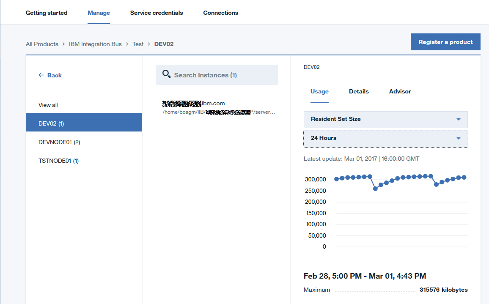

---

copyright:
  years: 2016, 2017
lastupdated: "2017-3-3"

---

<!-- Common attributes used in the template are defined as follows: -->
{:new_window: target="_blank"}
{:shortdesc: .shortdesc}

# IBM {{site.data.keyword.product-insights_short}} について
{: #about_product-insights}

{{site.data.keyword.product-insights_full}} は、IBM Connect to Cloud に含まれている IBM Bluemix サービスです。オンプレミスの IBM ソフトウェア製品を {{site.data.keyword.product-insights_short}} サービスに接続し、実行中の製品インベントリーとランタイム使用量メトリックを洞察できるようにします。

{:shortdesc}

{{site.data.keyword.product-insights_short}} サービスはエントリー・ポイントです。将来、機能が追加される可能性があります。

{{site.data.keyword.product-insights_short}} には以下の機能が用意されています。

* オンプレミスの IBM ソフトウェア製品を IBM (具体的には Bluemix サービス) に登録する。
* 接続されたオンプレミス製品のデータおよび関連する使用量データを収集する。
* ランタイム使用量データのダッシュボードにより、製品の使用量とワークロードに関するリアルな洞察を提供する。

{{site.data.keyword.product-insights_full}} の機能を利用するには、以下の手順を実行します。

1. {{site.data.keyword.product-insights_short}} 用のサービスを Bluemix 内に 1 つ以上作成します。
1. オンプレミスの IBM ソフトウェア製品を必要なリリース・レベルにアップグレードし、製品のインストール済み環境ごとに有効化コードを追加します。 
1. {{site.data.keyword.product-insights_short}} サービス・インスタンスの {{site.data.keyword.bluemix_short}} 資格情報を使用して、ソフトウェアのインストール済み環境を構成します。すべてのデータは、それらの資格情報を使用して安全に保管されます。データを利用できるのは、このサービスに対する適切な権限を持つユーザーのみです。

## 仕組み
{: #product-insights_howitworks}
{{site.data.keyword.product-insights_full}} サービスは、オンプレミスの IBM ソフトウェア製品と統合することで、ランタイムの製品情報と使用量メトリックを収集して表示します。まずは、IBM ソフトウェア製品のサブセットを、このサービスと統合できるように有効化します。オンプレミスのソフトウェア製品を登録して接続すると、それらの製品は定期的に起動情報と使用量情報を送信するようになります。これらの情報は、構成した資格情報を使用して、このサービス・インスタンスに関連付けて保管されます。この情報を Bluemix でサービス・インスタンス・ダッシュボードを使用して表示することができます。

以下の図に示すように、{{site.data.keyword.product-insights_short}} ソリューションには複数のコンポーネントが含まれます。

。  

## 組織とスペース
{: #product-insights_orgs}
{{site.data.keyword.product-insights_full}} サービスには単一の Bluemix 組織およびスペースを関連付けます。また、サービスは固有の資格情報を持ちます。少なくとも 1 つの Bluemix 組織とスペースをセットアップする必要があります。データを分離する必要がある場合は、例えば、アクセスを特定のユーザーに制限したい場合は、1 つの組織内に複数のスペースを作成し、スペースごとに 1 つのサービス・インスタンスを配置することができます。サービス・インスタンスごとに、IBM ソフトウェア製品に提供する必要がある固有の資格情報を持ちます。

一式の資格情報を使用して構成された製品の情報は、それらの資格情報を持つサービスでのみ参照できます。必要な場合は、それぞれに固有の資格情報を持つ複数のサービスを作成して、データを分離することができます。

## サービス・ダッシュボード
{: #service_dashboard}
サービス・インスタンスを作成すると、サービス・ダッシュボードが表示されます。組織ダッシュボードのサービス・アイコンをクリックして、いつでもサービス・ダッシュボードに戻ることができます。サービス・ダッシュボードからは以下の項目にアクセスできます。

* 「概説」資料
* オンプレミス製品を接続するために必要なサービス資格情報
* サポート対象製品および {{site.data.keyword.product-insights_short}} サービス・インスタンスに登録されているランタイム・インスタンスのインベントリー
* 接続されているランタイム・インスタンスの使用量情報
* 接続されているランタイム・インスタンスの製品情報と環境情報

「管理」タブに製品がリストされていない場合は、**「製品の登録 (Register a product)」**をクリックしてサポート対象製品のリストを参照し、製品インスタンスの接続方法に関する具体的な情報を表示してください。

## 製品の登録
{: #product-insights_register}
**「管理」**タブで**「製品の登録 (Register a product)」**をクリックして、サポート対象製品のリストを表示します。目的の製品までスクロールするか、検索フィールドを使用して製品リストをフィルタリングします。

製品のインスタンスを登録する手順を参照するには、リストからその製品を選択します。

製品インスタンスを {{site.data.keyword.product-insights_short}} サービスに接続すると、その製品インスタンスがダッシュボードの**「管理」**タブに表示されます。ダッシュボードには、接続されている複数の製品インスタンスが、製品の種類にかかわらずリストされます。

## 製品インベントリー
{: #product-insights_products}
{{site.data.keyword.product-insights_short}} にデータを送信できるように各製品インスタンスを有効化したら、サービス・ダッシュボードの**「管理」**を選択してインベントリーを表示できます。

 

{{site.data.keyword.product-insights_short}} では、製品と製品インスタンスは異なります。製品には、IBM MQ や IBM WebSphere Application Server Liberty Network Deployment などの製品名があります。製品インスタンスとは、インストールされ、実行されている製品を表すものです。製品によっては、同じインストール環境内から複数のインスタンスを実行できるものがあります。例えば、WebSphere Application Server Liberty Network Deployment は、製品の単一のインストール環境から作成された複数のアプリケーション・サーバーを実行できます。

サービス・ダッシュボードでは、**「製品」**ペインの選択項目*「すべて表示」*の下に、登録された製品の名前が表示されます。接続されているインスタンスは、**「インスタンス」**ペインにリストされます。このペインには、**「製品」**ペインで選択した製品のインスタンスが表示されます。以下の例では、「製品」ペインで*「すべて表示」*項目が選択されているため、すべての製品インスタンスが表示されています。この例では 6 つの製品が表示されており、その中には複数のインスタンスが接続されているものがあります。インスタンスのリストをフィルタリングするには、**「インスタンスの検索 (Search Instances)」**フィールドを使用するか、製品の項目を選択します。製品インスタンスの詳細を表示するには、**「インスタンス」**ペインでその項目を選択します。

表示される製品インスタンスのリストは、ユーザーが参照している内容に応じてフィルタリングされます。ナビゲーションに役立つように、選択したインスタンスまでの参照パスが表示されます。

 

## 製品インスタンスの情報
{: #product-insights_productinstances}
製品インスタンスを選択すると、**「インスタンスの詳細」**ペインにデータが表示されます。このペインには、使用量データ、製品の詳細情報、製品インスタンスに関する推奨情報 (これは **「アドバイザー (Advisor)」**タブに表示されます) が示されます。

## 使用量情報
{: #product-insights_usage}
使用量情報は**「使用量」**タブに表示されます。2 つのドロップダウン・リストを使用して、表示するメトリック (製品インスタンスが複数のメトリックを送信する場合) と、表示する期間を選択します。

製品インスタンスが複数のメトリックを送信する場合は、1 番目のドロップダウンを使用して、表示するメトリックを選択します。2 番目のドロップダウンでは、表示する期間を選択します。各セクションの期間として選択できるオプションは、過去 24 時間、1 週間、1 カ月、6 カ月、1 年です。

1 番目のセクションには、選択した期間におけるメトリック値の平均最大値、平均値、平均最小値、合計値が表示されます。2 番目のセクションには、X 軸を期間として対象期間内の値を示すグラフが表示されます。X 軸の期間は、選択した期間に応じて変わります。例えば、過去 24 時間を選択した場合、グラフの点の表示間隔は 1 時間単位になりますが、1 週間を選択した場合はその週の日単位になります。最後のセクションには、選択したグラフ上の点における最大値、平均値、最小値が表示されます。グラフ上の別の点の各値を表示するには、時間バーを新たな位置にドラッグします。

対象期間にデータが存在しない場合は、メッセージが表示されます。例えば、停止したインスタンスはデータを提供しないため、停止期間のデータは表示されません。他の期間にすると、使用量が表示される可能性があります。他の期間を表示するには、ドロップダウンで期間を変更します。

**「詳細」**タブには、以下の項目を含む製品インスタンス情報が表示されます。

* 製品名およびバージョン
* 製品がインストールされている場所 (ホスト名とディレクトリーを含む)
* インスタンスが始動時の情報を最後に送信した時刻
* インスタンス ID (単一のディレクトリー内に複数のインスタンスを作成できる製品の場合)

 

製品インスタンスは、以下のオプションの情報も提供します。

* インストールされている APAR のリスト。 
* オペレーティング・システムとそのバージョン。これは**「環境」**タブに表示されます。

* コンポーネントまたはインストール済みのフィーチャー。これらは**「コンポーネント」**タブに表示されます。この例では、IBM Product XYZ のインスタンスが追加のコンポーネント情報を提供しないため、**「コンポーネント」**タブが表示されていません。

* 製品インスタンスの固有 ID。これは、ホスト名、ディレクトリー、インスタンス ID を組み合わせたものです。

 

## 検索 
{: #product-insights_search}
**「製品のインスタンス」**ペインには、製品リストをフィルタリングするための基本的な検索機能があります。検索フィールドに、検索に使用する文字列を入力します。検索できる対象は、製品インスタンスのデータ (つまり、**「詳細」**タブの情報) のみです。

<!-- If your service doc doesn't have a troubleshooting topic or section, you can add the following to your About: -->
<!-- Add a heading and content for how to get help and support. Use this template for beta and GA services:  -->
## {{site.data.keyword.product-insights_short}} 用のヘルプの入手
{: #gettinghelp}

サービスの作成、有効な IBM ソフトウェア製品に対する更新の取得、インストールと構成の手順の詳細については、[{{site.data.keyword.product-insights_full}} Technical Community](https://developer.ibm.com/product-insights/) を参照してください。{{site.data.keyword.product-insights_short}} の使用について問題点または不明な点がある場合は、このコミュニティーのフォーラム・セクションで質問を参照または投稿してください。質問には、開発およびカスタマー・プログラム・チームが対応します。

また、Stack Overflow フォーラムと IBM DeveloperWorks dw Answers フォーラムを利用して、質問を参照または投稿することもできます。サービスや開始手順に関する質問については、IBM developerWorks dW Answers をご利用ください。これら 2 つのフォーラムのいずれかで質問を投稿するときには、Bluemix 開発チームがお客様の質問を簡単に見つけられるように、以下のタグ付けルールを適用してください。

* [Stack Overflow](http://stackoverflow.com/search?q=hybrid-connect+ibm-bluemix){:new_window} をクリックして投稿し、質問に「ibm-bluemix」と「productinsights」というタグを付けます。
* [IBM developerWorks dW Answers](https://developer.ibm.com/answers/smartspace/productinsights/){:new_window} をクリックして投稿し、質問に「productinsights」または「hybridconnect」というタグを付けます。

フォーラムの使用方法について詳しくは、[ヘルプの取得](https://www.{DomainName}/docs/support/index.html#getting-help)に関するトピックを参照してください。
